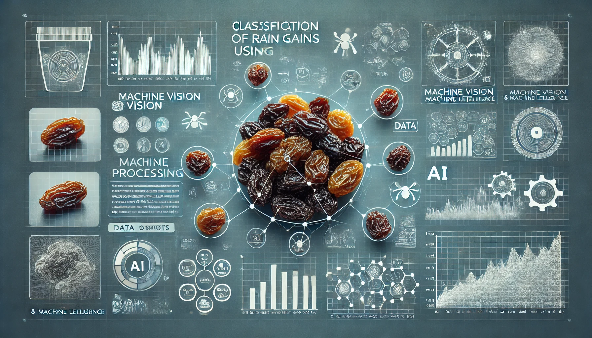

# Raisin Class Prediction using Logistic Regression, KNN, SVM, and Decision Tree

Raisin Class Prediction project! This project aims to classify two different varieties of raisins (Kecimen and Besni) grown in Turkey using various machine learning techniques.

## Introduction

## Dataset

The dataset used in this project contains 900 samples with 8 features each. The features include:

1. **Area**: Number of pixels within the boundaries of the raisin grain.
2. **Perimeter**: Distance between the boundaries of the raisin grain and the surrounding pixels.
3. **MajorAxisLength**: Length of the main axis, the longest line that can be drawn on the raisin grain.
4. **MinorAxisLength**: Length of the small axis, the shortest line that can be drawn on the raisin grain.
5. **Eccentricity**: Measure of the eccentricity of the ellipse that has the same moments as the raisins.
6. **ConvexArea**: Number of pixels of the smallest convex shell of the region formed by the raisin grain.
7. **Extent**: Ratio of the region formed by the raisin grain to the total pixels in the bounding box.
8. **Class**: Type of raisin grain (Kecimen or Besni).

## Project Description

In this study, a machine vision system was developed to distinguish between two different varieties of raisins (Kecimen and Besni). A total of 900 raisin grains were obtained, with an equal number of samples from each variety. These images were subjected to various preprocessing steps, and 7 morphological feature extraction operations were performed using image processing techniques. The distributions of both raisin varieties on the features were examined and shown in graphs. Later, models were created using Logistic Regression, KNN, SVM, and Decision Tree machine learning techniques, and their performance was evaluated.

## Exploratory Data Analysis (EDA)

The EDA section involves:
- **Understanding The Data**: Basic statistics and distributions of the dataset.
- **Detection of Outliers**: Identifying and handling outliers in the data.
- **Correlation**: Examining the relationships between different features.

## Modeling

### Logistic Regression
Logistic Regression was applied to classify the raisin types. Different preprocessing steps and hyperparameter tuning were performed to improve the model performance.

### K-Nearest Neighbors (KNN)
KNN was used to classify the raisin types based on the nearest neighbors. The model was optimized by tuning the number of neighbors and distance metrics.

### Support Vector Machine (SVM)
SVM was employed to find the optimal hyperplane that separates the two classes. Various kernels and parameters were tested to achieve the best performance.

### Decision Tree
Decision Tree classifier was used to create a model that predicts the class based on feature splits. The model was fine-tuned by adjusting the tree depth and other parameters.

## Model Comparison

The performance of the models was compared using metrics such as accuracy, precision, recall, and F1-score. Confusion matrices and ROC curves were plotted to visualize the results.